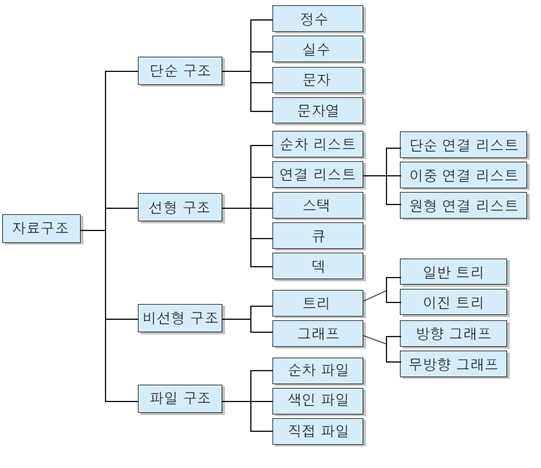

# 자료구조



## Object와 Array


## 추상자료형 ADT(Abstract Data Type)

- **데이터의 추상적 형태**와 **그 데이터를 다루는 방법**만을 정해놓은 것

## [Stack](https://codepen.io/thonly/pen/GMyLOV)

- 데이터를 집어넣을 수 있는 선형(linear) 자료형
- LIFO
- 데이터를 집어넣는 push, 데이터를 추출하는 pop, 맨 나중에 집어넣은 데이터를 확인하는 peek
- 서로 관계가 있는 여러 작업을 연달아 수행하면서 **이전의 작업 내용을 저장해 둘 필요가 있을 때** 널리 사용됩니다.

```js
class Stack {
  constructor() {
    this._arr = [];
  }
  push(item) {
    this._arr.push(item);
  }
  pop() {
    return this._arr.pop();
  }
  peek() {
    return this._arr[this._arr.length - 1];
  }
}

const stack = new Stack();
stack.push(1);
stack.push(2);
stack.push(3);
stack.pop(); // 3
```

## [Queue](https://codepen.io/thonly/pen/KypxZg)

- 데이터를 집어넣을 수 있는 선형(linear) 자료형
- FIFO
- 데이터를 집어넣는 enqueue, 데이터를 추출하는 dequeue
- **순서대로 처리해야 하는 작업을 임시로 저장해두는 버퍼(buffer)**로서 많이 사용됩니다.

```js
class Queue {
  constructor() {
    this._arr = [];
  }
  enqueue(item) {
    this._arr.push(item);
  }
  dequeue() {
    return this._arr.shift();
  }
}

const queue = new Queue();
queue.enqueue(1);
queue.enqueue(2);
queue.enqueue(3);
queue.dequeue(); // 1
```

## [Linked List](https://codepen.io/thonly/pen/QqRVJX)

- 연결된 목록은 클라이언트와 서버 모두에 유용합니다. 클라이언트에서 Redux와 같은 상태 관리 라이브러리는 미들웨어 논리를 연결 목록 방식으로 구성합니다. 조치가 전달되면 리듀서에 도달하기 전에 모든 것이 방문 될 때까지 미들웨어에서 다음 미들웨어로 파이프됩니다. 서버에서 Express와 같은 웹 프레임 워크도 비슷한 방식으로 미들웨어 논리를 구성합니다. 요청이 수신되면 응답이 발행 될 때까지 하나의 미들웨어에서 다음 미들웨어로 파이프됩니다.

```js
var LinkedList = function () {
  var list = {};
  list.head = null;
  list.tail = null;

  list.addToTail = function (value) {
    let node = new Node(value);

    if (!this.head) {
      this.head = node;
      this.tail = node;
    } else {
      this.tail.next = node;
      this.tail = node;
    }
  };

  list.removeHead = function () {
    let removeNode = this.head;
    if (TimeRanges.head !== null) {
      this.head = removeNode.next;
      return removeNode.value;
    }
  };

  list.contains = function (target) {
    let accNode = this.head;
    while (accNode) {
      if (accNode.value === target) {
        return true;
      }
      accNode = accNode.next;
    }
    return false;
  };

  return list;
};


var Node = function (value) {
  var node = {};

  node.value = value;
  node.next = null;

  return node;
};

```

## Tree

```js
var Tree = function (value) {
  var newTree = Object.create(treeMethods);
  newTree.value = value;

  newTree.children = [];

  return newTree;
};

var treeMethods = {};

treeMethods.addChild = function (value) {
  let node = new Tree(value);
  this.children.push(node);
};

treeMethods.contains = function (target) {
  let result = false;

  function recusion(element) {
    if (element.value === target) {
      result = true;
      return;
    }
    for (let i = 0; i < element.children.length; i++) {
      recusion(element.children[i]);
    }

  }
  recusion(this);
  return result;
};
```


## Graph

## Hash table


## 참고

- [JS로 만나는 세상](https://helloworldjavascript.net/pages/282-data-structures.html)
- [JS 알고리즘](https://github.com/trekhleb/javascript-algorithms)
- [JS linked list](https://velog.io/@760kry/JS-Linked-List-vs-Array-List-data-structor)