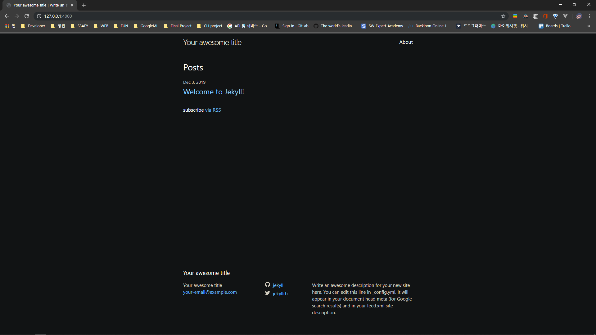

# Jekyll Basics

## 개요

- Jekyll ? 
  - 텍스트 변환 엔진
  - Github pages 의 내부 엔진 -> Github 서버 무료 호스팅 가능
  - 정적 웹사이트 생성기
  - Markdown 파일로 컨텐츠 작성 + Liquid 기능이 추가된 HTML 템플릿 사용
  - Ruby Gem의 하나
  - 템플릿 처리 작업을 위해 `Liquid` 템플릿 언어 사용
    - https://shopify.github.io/liquid/

### 목표

- [Jekyll 빠른시작 설명서]: https://jekyllrb-ko.github.io/docs/quickstart/

- Jekyll을 이용해 개인 블로그를 Github.io에 Deploy

### 준비

Windows는 공식적으로 지원되는 플랫폼이 아니다. 정상작동을 위해 준비물이 있다.

**주의**: windows 환경에서 UTF-8 인코딩 사용 시 파일에 `BOM` 헤더 문자가 있으면 안된다.

- 작업 환경

```
OS: Windows 10 64 bit (x86)
Editor: Visual Studio Code
Terminal: Git-bash, Windows Powershell, CMD
```

- 준비물
  - Ruby : version higher than 2.2.5, including every development headers 
  - RubyGems : 
  - GCC
  - Make

- 사용버전

```
Ruby: ruby 2.6.5p114 (2019-10-01 revision 67812) [x64-mingw32]
RubyGems: 3.0.3
jekyll: 4.0.0
GCC(gcc, g++): (x86_64-posix-seh-rev0, Built by MinGW-W64 project) 8.1.0
Make: GNU Make 4.2.1
```

#### Ruby & RubyGems : windows용 설치

1. `RubyInstaller` for Windows 
   - https://rubyinstaller.org/
   - `Ruby+Devkit 2.6.5-1 (x86)`
   - 2.4.x 이상, Devkit 설치 필요
   - `PATH` 설정 필요 (설치 시 자동)

#### GCC 설치

- GCC? 
  - GNU Compiler Collection, (GNU 컴파일러 모음)
  - [GCC 위키피디아 링크](https://ko.wikipedia.org/wiki/GNU_컴파일러_모음)

- 설치관련 참고 페이지: https://brunch.co.kr/@mystoryg/56

1. MinGW-w64 설치

   - [https://sourceforge.net/projects/mingw-w64/files/Toolchains%20targetting%20Win32/Personal%20Builds/mingw-builds/installer/mingw-w64-install.exe/download](https://sourceforge.net/projects/mingw-w64/files/Toolchains targetting Win32/Personal Builds/mingw-builds/installer/mingw-w64-install.exe/download)
   - Online installer 사용
   - 설치 세팅

   ```
   version: 8.1.0
   Architecture: x86_64
   Threads: posix      # Thread option 변경 win32 -> posix
   Exception: seh
   Build revision: 0	
   ```

   - https://stackoverflow.com/questions/17242516/mingw-w64-threads-posix-vs-win32
   - 환경변수 `PATH` 설정 : `win + r` -> `sysdm.cpl` 
     -  `C:\Program Files\mingw-w64\x86_64-8.1.0-posix-seh-rt_v6-rev0\mingw64\bin` 
     - **`Mingw` 이미 설치했다면 `C:\MinGW\bin` 보다 무조건 위에 새로 만들기**

2. Mingw 설치

   - http://www.mingw.org/
   - MinGW Installation manager
     - `mingw32-base-bin`, `mingw32-gcc-g++-bin` **필수** 체크, apply change 
   - 환경변수 `PATH` 설정 : `win + r` -> `sysdm.cpl` -> 환경변수
     - `C:\MinGW\bin`

- **설치 후 터미널에서 gcc -v 통해 `(x86_64-posix-seh-rev0, Built by MinGW-W64 project)` 메세지 확인 필요**

#### Make 설치

- `Chocolatey` 이용
  - 관리자 권한 실행, `choco install make` 

#### Jekyll과 Bundler 설치

- `bundler`: 다른 루비 젬들을 관리하는 루비 젬

- `gem install jekyll bundler`

- `jekyll -v` 버전 확인

<hr>

## 새  Jekyll 사이트 생성

```terminal
# ./myblog 에 새 Jekyll 사이트를 생성한다
jekyll new myblog

# 생성된 디렉토리로 이동한다
cd myblog

# 미리보기 서버로 사이트를 빌드한다
bundle exec jekyll serve

# 이제 브라우저로 http://localhost:4000 에 접속한다
```

- `http://localhost:4000`



<hr>

## 기본 구조

- https://jekyllrb-ko.github.io/docs/structure/

```
.
├── _config.yml
├── _data
|   └── members.yml
├── _drafts
|   ├── begin-with-the-crazy-ideas.md
|   └── on-simplicity-in-technology.md
├── _includes
|   ├── footer.html
|   └── header.html
├── _layouts
|   ├── default.html
|   └── post.html
├── _posts
|   ├── 2007-10-29-why-every-programmer-should-play-nethack.md
|   └── 2009-04-26-barcamp-boston-4-roundup.md
├── _sass
|   ├── _base.scss
|   └── _layout.scss
├── _site
├── .jekyll-metadata
└── index.html # 'index.md' 이어도 되지만 올바른 YAML 머리말이 필요합니다
```

#### 환경설정

- root 디렉토리의 `_config.yml` 혹은 터미널에서 `jekyll`실행 시 플래그로 지정 가능
- https://jekyllrb-ko.github.io/docs/configuration/